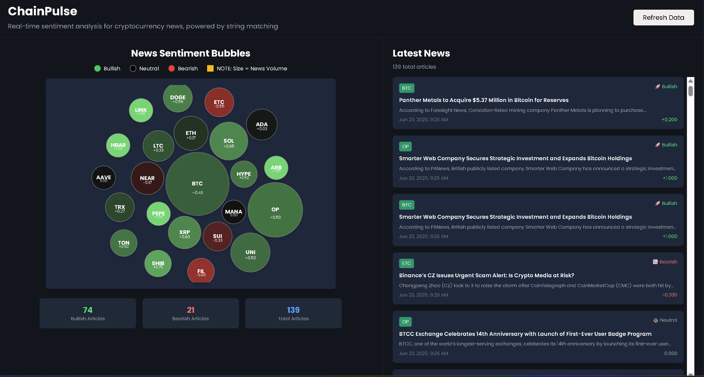

<div align="center">
   
</div>

> **Implementasi "String Matching Algorithms for Cryptocurrency News Sentiment Analysis and Price Prediction"**

> Dipakai untuk kebutuhan makalah **IF2211 Strategi Algoritma**

---

# **ChainPulse**

ChainPulse is a full-stack web application that analyzes real-time cryptocurrency news to extract coin sentiment using advanced string matching algorithms such as Aho-Corasick, Levenshtein (fuzzy matching), and regex. It offers an interactive dashboard powered by D3.js for visualizing coin sentiment trends from the CryptoPanic API.

<div align="center">
    

> <b>Dikembangkan dengan ❤️ untuk Strategi Algoritma </b>

</div>

---

## Features & Technologies

#### ChainPulse offers the following features:

-   Real-time cryptocurrency news aggregation
-   Sentiment analysis on crypto news
-   Coin mention detection and tracking
-   News sentiment scoring based on string matching algorithms and coin mention detection
-   Interactive frontend dashboard with bubble chart visualization

[](https://www.python.org/)
[](https://fastapi.tiangolo.com/)
[](https://www.sqlalchemy.org/)
[](https://www.sqlite.org/)
[](https://nextjs.org/)
[](https://www.typescriptlang.org/)
[](https://d3js.org/)
[](https://tailwindcss.com/)
[](https://cryptopanic.com/)

---

## Prerequisites

-   Python 3.11+
-   Node.js 18+
-   pnpm (recommended) or npm
-   CryptoPanic API key

## Installation & Setup

1. **Clone the repository**

```bash
git clone https://github.com/andrewtedja/chain-pulse.git
cd chain-pulse
```

2. **Backend Setup**
   From root directory:

```bash
cd backend
python -m venv venv
source venv/bin/activate # On Windows: source venv\Scripts\activate
pip install -r requirements.txt
```

---

## **Create .env file (inside backend/) with:**

```env
CRYPTO_PANIC_API_KEY=your_api_key_here
CRYPTO_PANIC_BASE_URL=https://cryptopanic.com/api/v2/posts/
```

> **Note**: The CryptoPanicAPI key is limited and required to fetch news data from CryptoPanic, you can get it from https://cryptopanic.com/developers/api/ after you sign up (and add to the .env file).

> You can make the .env file based on .env.example

3. **Frontend Setup**
   From root directory:

```bash
cd frontend
pnpm install
```

## Running the Application

### (Option 1) Running Concurrently:

1. Get to root directory (outside frontend/ or backend/) using:

```bash
cd chain-pulse
or
cd .. (from frontend/ or backend/)
```

2. Run the following command:

```bash
pnpm run dev
```

> This will start both the backend and frontend servers concurrently, and you can access the local web on http://localhost:3000.

### (Option 2) Running Individually:

1. Start the backend server:

```bash
cd backend
python main.py
# Server runs on http://localhost:8081
```

2. Start the frontend dev server:

```bash
cd frontend
pnpm dev
# Frontend runs on http://localhost:3000
```

> This will start both the backend and frontend servers, and you can access the local web on http://localhost:3000.

---

## Project Structure

```
chain-pulse/
├── README.md
├── package.json
├── pnpm-lock.yaml
├── .gitignore
├── .github/
│   └── workflows/
│       └── ci.yml
├── backend/
│ ├── app/
│ │ ├── models.py # Database models (News)
│ │ ├── services.py # API endpoints and business logic
│ │ ├── database.py # Database connection
│ │ └── coins.py # Crypto coins related utilities
│ └── main.py # FastAPI application entry (uvicorn)
└── frontend/
    ├── public/ # Static assets
    └── src/
        ├── app/
        │   ├── _components/
        │   │   └── Dashboard.tsx
        │   ├── types/
        │   │   └── types.tsx # Shared types
        │   ├── layout.tsx # Shared layout
        │   └── page.tsx # Contains Dashboard component
        ├── .env.local
        └── package.json
```

> **Note**: The `package.json` in the frontend/ directory is different than the one in the root directory. The root directory is used for concurrently (library for running multiple terminals concurrently) and the frontend/ directory is used for running the frontend dev server.

---

## Author

| Author                                                | NIM      |
| ----------------------------------------------------- | -------- |
| [Andrew Tedjapratama](https://github.com/andrewtedja) | 13523148 |

---

## License

This project is released under the [MIT License](LICENSE).
